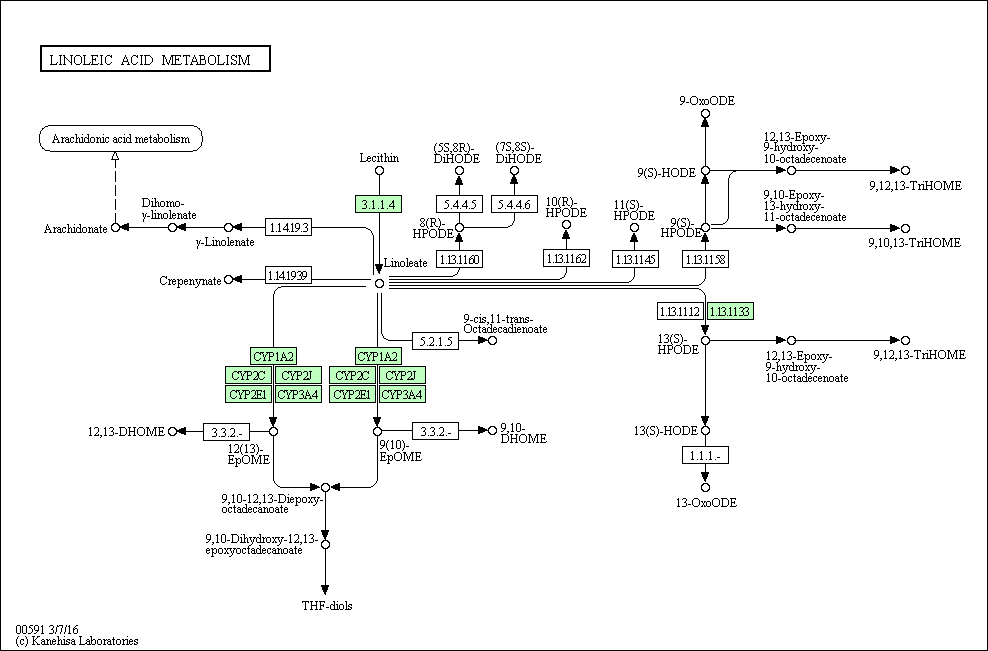
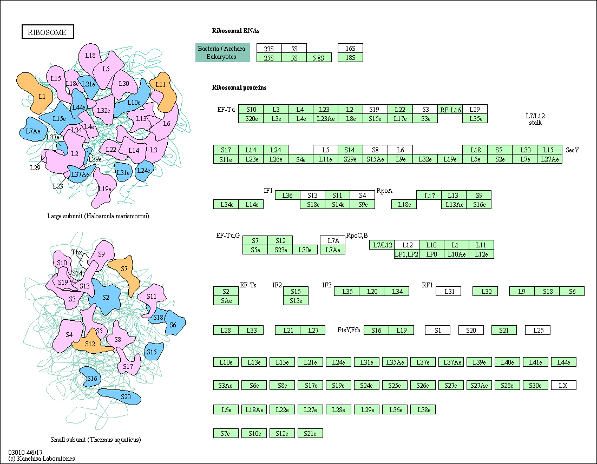
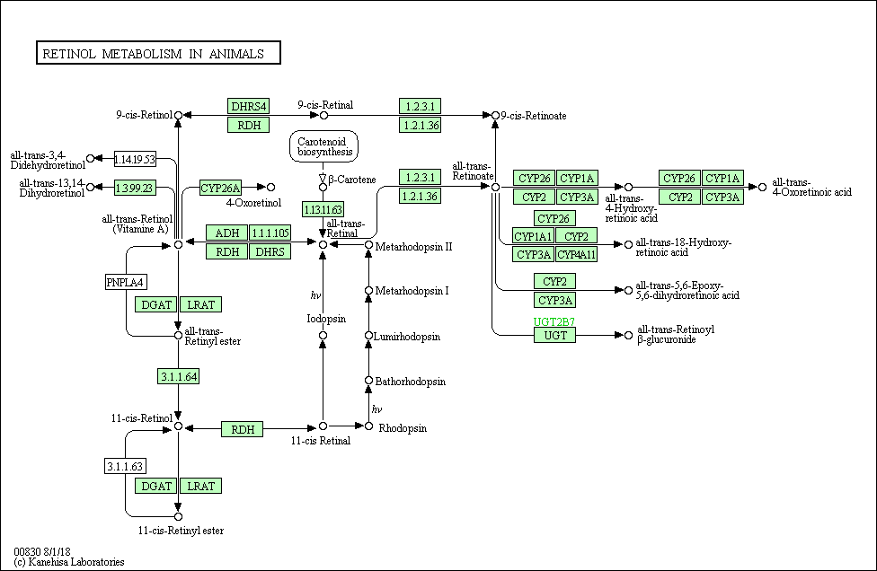
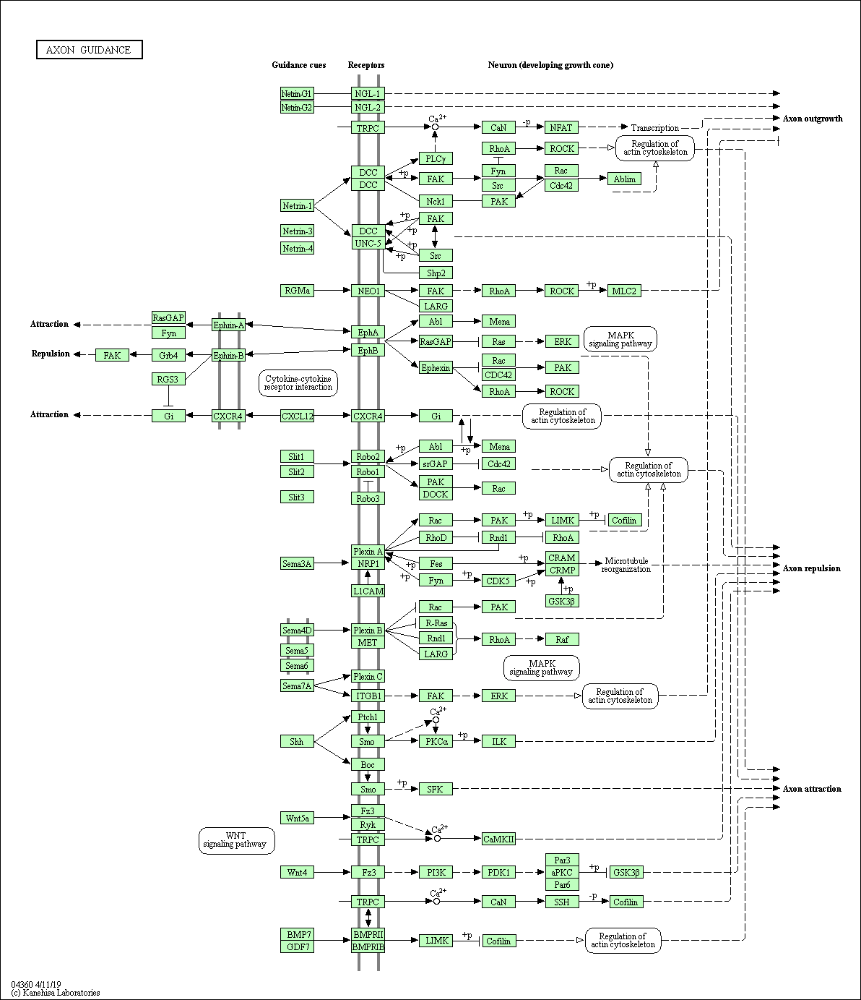
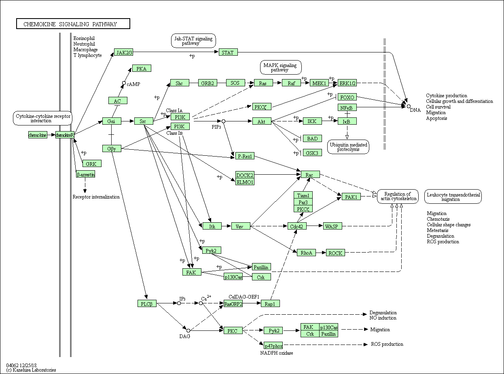

RNA-seq Analysis
================
Shane Crinion
31/3/2020

## Where do we get RNA-seq data?:

In order to analyse RNA-seq data, you need to get RNA-seq data\! The
data used in this tutorial has been extracted from the Gene Expression
Omnibus (GEO), a repository of gene expression data for anyone to use.

To find RNA-seq data on GEO:

  - Go to Filters to the left of search results
  - For experiment type select ‘Expression profiling by high throughput
    sequencing’.
  - Look through results for GEO DataSet that contains SRR files in the
    supplementary data.

## What do I need to perform the analysis?

1.  SRA tools (prefetch & fastq-dump) - download SRA files (with
    prefetch), split by reads (fastq-dump) and convert to FASTQ
    (fastq-dump).
2.  Salmon - to perform indexing and quantification.
3.  R (and R Studio would be useful) - to perform data analysis.

# Part 1: Extract & Prepare RNA-seq data

### 1.1 Download and install SRA toolkit

Download SRA toolkit
(<https://github.com/ncbi/sra-tools/wiki/02.-Installing-SRA-Toolkit>)
using the appropriate installation process for your system. - Make sure
it’s installed by running `prefetch` or `fastq-dump`. If no errors show
up, it probably installed okay.

### 1.2 Create a sample list

Save a list of the RNA-sea sample SRA codes that you want to download
(these codes can be found on GEO)

``` bash
touch SraList.txt # make a blank text file called SraList.txt
echo 'SRR1658041' >> SraList.txt # add this sample to file
echo 'SRR1658038' >> SraList.txt # etc...
echo 'SRR1658044' >> SraList.txt
echo 'SRR1658047' >> SraList.txt
echo 'SRR1658050' >> SraList.txt
echo 'SRR1658053' >> SraList.txt
```

If you have a lot of samples than above, you should look up how to write
Bash or Nextflow scripts to make this process faster.

### 1.3. Download samples using `prefetch`.

  - This will extract samples from GEO and download locally.
  - Each sample quite large approx (1 ~ 5 Gb) so this may take a while.

<!-- end list -->

``` bash
prefetch --option-file SraAccList.txt
```

### 1.4. Split reads and convert to FASTQ.

  - Convert to FASTQ to perform indexing & quantification.
  - Splitting is useful if paired end sequencing was performed (**Paired
    end sequencing**: sequencing of both ends of fragment to generate
    high quality, alignable sequence data. This can help identify
    genomic rearrangements and repetitive sequence elements.)
  - This will add ‘-1’ & ‘-2’ to the end of file name eg.
    ‘SRR1658053.sra’ -\> ‘SRR1658053\_1.fastq’ &
    ‘’SRR1658053\_2.fastq’.
  - These samples are single end reads so only ’\_1.fastq’ will be
    generated for each.
  - **\!\!WARNING\!\!** each FASTQ file will take up about **10 Gb** of
    memory. You can compress each FASTQ using the command gzip (eg.
    ‘gzip SRR1658053\_1.fastq’) to go from 10GB -\> ~ 1Gb each. This
    will add ‘.gz’ to the end of the file (‘eg.
    SRR1658053\_1.fastq.gz’).

### 1.5. Perform indexing using Salmon

  - Download the appropriate reference transcript.
  - The indexing step is performed once on the reference transcripts.
    You need to consider the alignment (eg. hg19 or hg38)

<!-- end list -->

``` bash
salmon index -t Mus_musculus.GRCm38.cdna.all.fa.gz -i Mus_musculus_index
```

### 1.6 Perform quantification using Salmon

  - Quantification is performed with the indexing output and each fastq
    file.

<!-- end list -->

``` bash
salmon quant -i $HOME/RNA-seq/Mus_musculus_index -l A -r SRR1658047_1.fastq.gz -o $HOME/RNA-seq/SRR1658047
```

# Part 2: Import RNA-seq data to R

### Import Libraries

``` r
library(DESeq2)
library(AnnotationDbi); library(org.Mm.eg.db)
library(gplots); library(EnhancedVolcano); library(ggplot2); library(pheatmap)
library(GenomicFeatures)
library(tximport)
library(knitr)
library(reshape2); library(dplyr)
library(pathview); library(gage); library(gageData)
```

### 2.1. Import Gene Transfer File (GTF), transcript names & gene mapping.

  - We need the GTF for importing quantification files.
  - The GTF contains information about the gene structure and anotation.
  - Download the appropriate GTF file for your genome from the Ensembl
    database (//ftp.ensembl.org/pub/release-95/gtf/).
  - Save as TxDb file containing transcript annotations.

<!-- end list -->

``` r
txdb <- makeTxDbFromGFF(
  "ftp://ftp.ensembl.org/pub//release-95/gtf/mus_musculus/Mus_musculus.GRCm38.95.chr.gtf.gz")
```

    ## Import genomic features from the file as a GRanges object ... OK
    ## Prepare the 'metadata' data frame ... OK
    ## Make the TxDb object ...
    
    ## Warning in .get_cds_IDX(mcols0$type, mcols0$phase): The "phase" metadata column contains non-NA values for features of type
    ##   stop_codon. This information was ignored.
    
    ## OK

``` r
# Store all the Ensembl Transcript (TX) names 
txname_keys <- keys(txdb, keytype = "TXNAME")

#Identify gene mapping between transcript and gene 
tx2gene <- select(txdb, txname_keys, "GENEID", "TXNAME")
```

    ## 'select()' returned 1:1 mapping between keys and columns

### 2.2 Make a phenotype status file

  - Make a file using your favourite text editor (eg. Vim, Excel) that
    indicates which samples are cases and which are controls, such as
    the file opened below.
  - Also generate strings to the quantification files using your new
    table.

<!-- end list -->

``` r
samp_pheno <- read.delim(
  paste0(Sys.getenv('HOME'),
         '/RNA-seq/sample_pheno.txt'))
row.names(samp_pheno) <- samp_pheno$sample

knitr::kable(samp_pheno)
```

|            | sample     | status |
| ---------- | :--------- | :----- |
| SRR1658038 | SRR1658038 | VEC    |
| SRR1658044 | SRR1658044 | VEC    |
| SRR1658050 | SRR1658050 | VEC    |
| SRR1658041 | SRR1658041 | CRE    |
| SRR1658047 | SRR1658047 | CRE    |
| SRR1658053 | SRR1658053 | CRE    |

``` r
# use this to generate strings for quantification file
quant_filepaths <- file.path(
  Sys.getenv('HOME'), 
  'RNA-seq', 
  samp_pheno$sample, 
  'quant.sf')
names(quant_filepaths) <- paste0(samp_pheno$sample)
```

### 2.3 Import quantification/expression data.

  - Import quant.sf contained in each sample folder eg.
    $HOME/RNA-seq/SRR1658038/quant.sf
  - The output contains 4 matrices: abundance (of each tx with a
    probablistic model), counts (raw counts to use with other tools that
    do their own normalisation), length and countsFromAbundance.

<!-- end list -->

``` r
samples.txi <- 
  tximport(quant_filepaths, 
           type = "salmon", 
           tx2gene = tx2gene, 
           ignoreTxVersion = TRUE)
```

    ## reading in files with read_tsv
    
    ## 1 2 3 4 5 6 
    ## transcripts missing from tx2gene: 831
    ## summarizing abundance
    ## summarizing counts
    ## summarizing length

Calculation of expression level (rows = protein, columns =
sample)’

``` r
kable(head(samples.txi$abundance))
```

|                    | SRR1658038 | SRR1658044 | SRR1658050 | SRR1658041 | SRR1658047 | SRR1658053 |
| ------------------ | ---------: | ---------: | ---------: | ---------: | ---------: | ---------: |
| ENSMUSG00000000001 |  65.649398 |  66.789502 |  66.865299 |  88.879534 |  88.621485 |  90.117782 |
| ENSMUSG00000000003 |   0.000000 |   0.000000 |   0.000000 |   0.000000 |   0.000000 |   0.000000 |
| ENSMUSG00000000028 |  21.515336 |  22.989429 |  24.071243 |  28.164933 |  28.366445 |  28.600829 |
| ENSMUSG00000000037 |   0.614557 |   0.794601 |   0.216300 |   1.669792 |   2.345165 |   2.003353 |
| ENSMUSG00000000049 |   0.748685 |   0.239807 |   0.194669 |   0.073252 |   0.000000 |   0.425384 |
| ENSMUSG00000000056 |   7.506815 |   6.967710 |   8.629231 |   6.233356 |   4.838816 |   4.649925 |

# Part 3: Perform differential expression analysis using R

  - **Differential expression analysis (DEA)** means taking normalised
    read count data and performing statistical analysis to discover
    quantitative changes in expression levels between experimental
    groups.
  - DEA is performed using the DESeq2 package.

### 3.1 Generate DESeqDataSet & DESeq objects

  - DESeqDataSet - reports expression log2fold change and p-values
    between groups.
  - DESeq - performs DEA based on Negative Binomial (Gamma-Poisson)
    Distribution.

<!-- end list -->

``` r
#BiocManager::install('DESeq2') 
samples.dea.ds <- # use TxDB expression object
  DESeqDataSetFromTximport(samples.txi, 
                           samp_pheno, 
                           ~status)
```

    ## using counts and average transcript lengths from tximport

``` r
samples.dds <- DESeq(samples.dea.ds)
```

    ## estimating size factors
    
    ## using 'avgTxLength' from assays(dds), correcting for library size
    
    ## estimating dispersions
    
    ## gene-wise dispersion estimates
    
    ## mean-dispersion relationship
    
    ## final dispersion estimates
    
    ## fitting model and testing

### 3.2 Explore DEA summary & dispersion

  - Summary tells us the number of genes with bi-directional LFC \> 0,
    outliers and other results.
  - Dispersion plot shows the dispersion by mean of normalized counts.
    We expect the dispersion to decrease as the mean of normalized
    counts increases.

<!-- end list -->

``` r
res <- results(samples.dds) #Obtain results
```

Summary of DEA results:

``` r
summary(res) #Summarise comparison of condition-specific variation
```

    ## 
    ## out of 21681 with nonzero total read count
    ## adjusted p-value < 0.1
    ## LFC > 0 (up)       : 4038, 19%
    ## LFC < 0 (down)     : 4204, 19%
    ## outliers [1]       : 5, 0.023%
    ## low counts [2]     : 4514, 21%
    ## (mean count < 1)
    ## [1] see 'cooksCutoff' argument of ?results
    ## [2] see 'independentFiltering' argument of ?results

``` r
plotDispEsts(samples.dds, log="xy", main='Estimate of per-gene dispersion by fitted mean')
```

<!-- -->

### 3.2 Explore group relationship using heatmaps and PCA.

  - **Heatmaps** indicate the correlation betweeen the samples.
  - We use the cor() command to understand how each sample correlates
    with each other.
  - The cor() function considers the range and shape of values to when
    calculating their relationship.
  - Heatmap scale goes from green (low correlation) to red (high
    correlation).
  - Column annotation shows samples with the same status/phenotype are
    very similar.

<!-- end list -->

``` r
# Log transform data to make reduce skewing
samples.logexprs <- rlogTransformation(samples.dds)
#install.packages('pheatmap') ; 
samples.correl <- cor(assay(samples.logexprs))
pheatmap(samples.correl, 
         col=greenred(75),
         show_colnames = FALSE,
         annotation_names_row = FALSE,
         main = 'Heatmap of Correlation between Samples',
         annotation_row = samp_pheno['status'])
```

<!-- -->

  - **Principal Component Analysis** is used to emphasise variation and
    bring out strong patterns.
  - We use it to visualise the difference between groups, just like with
    the heatmap.

<!-- end list -->

``` r
plotPCA(samples.logexprs, 
        intgroup='status') +
  ggtitle('PCA of samples by group/phenotype') +
  theme(
    plot.title = element_text(hjust=.5)) 
```

<!-- -->

# Part 4. Explore differential gene expression

### 4.1 Histograms

  - *Histograms* are used to view the distribution of values. We can use
    it how the range of values.

<!-- end list -->

``` r
res.df <- as.data.frame(res)
res.df$gene <- row.names(res)

d <- melt(res.df[,c(1:6)])
```

    ## No id variables; using all as measure variables

``` r
ggplot(d,aes(x = value, col=variable, fill=variable)) + 
    geom_histogram(bins = 50) +
    ggtitle('Results from DESeq Analysis') +
    facet_wrap(~variable,scales = "free_x", nrow=2) +
    theme_bw() +
    theme(
      plot.title = element_text(hjust=.5), 
      axis.text.x = element_text(angle = 90),
      legend.position = 'none') 
```

    ## Warning: Removed 53659 rows containing non-finite values (stat_bin).

<!-- -->

### 4.2 MA Plot

  - *MA plots* are 2D scatter plots used to visualise gene expression in
    terms of 2 variables (M & A).
  - Variable M: Gene Expression changes in terms of log fold change (Y
    axis).  
  - Variable A: Log mean of expression counts of normal and treated
    samples (X axis).
  - Genes with little change cluster around M=0; Upregulated genes are
    above M=0 and downregulated are below M=0.
  - We don’t consider statistical significance (p-value) in the MA plot.

<!-- end list -->

``` r
DESeq2::plotMA(samples.dds, 
               main= 'MA plot of gene expression',
               alpha=0.45,
               ylim=c(-8,8))
```

<!-- -->

### 4.3 Volcano Plot

*Volcano plot* is another type of scatter plot that shows statistical
significance and log fold change. - This plot shows the names of genes
that are statistically signifcant and the direction of expression
change.

``` r
EnhancedVolcano(res.df, 
                  lab = as.character(res.df$gene),
                  labSize = 2.5,
                  subtitle = "",
                  pointSize = ifelse(res.df$log2FoldChange>3,6,1),
                  caption = "FC cutoff, 
                  3; p-value cutoff, 10e-16",
                  pCutoff = 10e-16,
                  FCcutoff = 3,
                x = 'log2FoldChange',
                y='padj',
                ylim=c(0,500),
                xlim=c(-10,12),
                title='Volcano Plot for RNA-seq Analysis')
```

    ## Warning: One or more p-values is 0. Converting to 10^-1 * current lowest non-
    ## zero p-value...

<!-- -->

### 4.4 Table

*Tables* are generated to explore significant genes identified in the
analysis.

Firstly, find out the frequency of significant gene expression changes:

``` r
kable(table(res$padj < 0.05))
```

| Var1  | Freq |
| :---- | ---: |
| FALSE | 9662 |
| TRUE  | 7500 |

Second, order genes by p-value to select the most significant genes.
Align these measurements with the gene counts per sample using merge().

``` r
res <- res[order(res$padj),] # align by p-value
res.metadata <- 
  merge(data.frame(res),
          data.frame(counts( # gene-exprs counts per sample
            samples.dds, normalized=TRUE)),
        by='row.names', # row.names = genes
        sort=F) # keep order by padj
kable(head(res.metadata))
```

| Row.names          |  baseMean | log2FoldChange |     lfcSE |       stat | pvalue | padj | SRR1658038 | SRR1658044 | SRR1658050 | SRR1658041 |  SRR1658047 |  SRR1658053 |
| :----------------- | --------: | -------------: | --------: | ---------: | -----: | ---: | ---------: | ---------: | ---------: | ---------: | ----------: | ----------: |
| ENSMUSG00000003746 |  8877.194 |       2.528917 | 0.0503702 |   50.20657 |      0 |    0 |  14599.102 | 15335.3704 |  15461.051 |  2765.0993 |  2497.03258 |  2605.50893 |
| ENSMUSG00000016918 |  4266.828 |     \-2.811942 | 0.0618459 | \-45.46690 |      0 |    0 |   1154.822 |   989.5959 |   1045.873 |  7601.1545 |  7400.34622 |  7409.17488 |
| ENSMUSG00000019772 | 30077.693 |       2.834661 | 0.0541932 |   52.30658 |      0 |    0 |  52173.041 | 54047.8745 |  52060.482 |  6803.2391 |  7508.50603 |  7873.01768 |
| ENSMUSG00000019929 |  1769.211 |       5.261685 | 0.1072002 |   49.08278 |      0 |    0 |   3357.478 |  3415.5674 |   3573.214 |    80.2804 |    88.83566 |    99.89315 |
| ENSMUSG00000024066 |  6013.254 |       3.213409 | 0.0525547 |   61.14408 |      0 |    0 |  11166.454 | 10783.8638 |  10619.490 |  1101.1079 |  1193.35585 |  1215.25051 |
| ENSMUSG00000024085 | 26334.843 |       1.756687 | 0.0415059 |   42.32376 |      0 |    0 |  40335.717 | 41367.3623 |  40220.888 | 12672.4014 | 11760.62093 | 11652.06574 |

# Part 5: Enrichment Analysis

### 5.1 Map gene information

Map the gene symbol, name and entrez ID using the AnnotationDbi package
and org.Mm.eg.db Mouse genome packages.

``` r
res$symbol <- 
  mapIds(org.Mm.eg.db, keys=row.names(res),
  column=c('SYMBOL'), keytype="ENSEMBL",
  multiVals="first")

res$name <- 
  mapIds(org.Mm.eg.db, keys=row.names(res),
  column=c('GENENAME'), keytype="ENSEMBL",
  multiVals="first")

res$entrezid <- 
  mapIds(org.Mm.eg.db, keys=row.names(res),
  column=c('ENTREZID'), keytype="ENSEMBL",
  multiVals="first")
```

From mapping, the top genes with expression changes are now
readable:

``` r
kable(head(res[,c('symbol','name', 'entrezid', 'padj')]))
```

|                    | symbol | name                              | entrezid | padj |
| ------------------ | :----- | :-------------------------------- | :------- | ---: |
| ENSMUSG00000003746 | Man1a  | mannosidase 1, alpha              | 17155    |    0 |
| ENSMUSG00000016918 | Sulf1  | sulfatase 1                       | 240725   |    0 |
| ENSMUSG00000019772 | Vip    | vasoactive intestinal polypeptide | 22353    |    0 |
| ENSMUSG00000019929 | Dcn    | decorin                           | 13179    |    0 |
| ENSMUSG00000024066 | Xdh    | xanthine dehydrogenase            | 22436    |    0 |
| ENSMUSG00000024085 | Man2a1 | mannosidase 2, alpha 1            | 17158    |    0 |

### 5.2 KEGG Pathway Analysis

KEGG pathways are a collection of pathway maps representing molecular
interactions and relationships. Performing KEGG pathway analysis can
give an insight into the processes effecting high level functionality in
biological systems.

Firstly, load datasets from gageData for KEGG pathways and indexing
numbers for signalling and metabolic (“cleaner”gene sets).
`kegg.sets.mm[sigmet.idx.mm]` gives you the “cleaner” gene sets of
sinaling and metabolic pathways
only.

``` r
data("kegg.sets.mm"); data("sigmet.idx.mm"); kegg_data <- kegg.sets.mm[sigmet.idx.mm]
```

Following this, identify the pathways of importance using GAGE
(Generally Applicable Gene-set Enrichment for Pathway Analysis). Set up
a df on Entrez ID & LFC to perform pathway analysis using the gage
package.

``` r
# df structured for kegg analysis
res.kegg.df <- 
  res$log2FoldChange ; names(res.kegg.df) <- res$entrezid

res.kegg <- gage(res.kegg.df, 
                 gsets=kegg.sets.mm, 
                 same.dir=TRUE)
```

**For Upregulated Pathways:**, visualise the pathway vs. the mapped
pathway expression found through the enrichement analysis.

``` r
suppressMessages(library(dplyr))
upreg <-
  data.frame(
  id=rownames(res.kegg$greater), res.kegg$greater) %>%
  tbl_df() %>%
  filter(row_number()<=5) %>%
  .$id %>%
  as.character()
knitr::kable(upreg)
```

| x                                             |
| :-------------------------------------------- |
| mmu00591 Linoleic acid metabolism             |
| mmu00860 Porphyrin and chlorophyll metabolism |
| mmu03010 Ribosome                             |
| mmu04370 VEGF signaling pathway               |
| mmu00830 Retinol metabolism                   |

Generate pathway graphs for upregulated pathways above:

``` r
pids_greater <- 
unlist(lapply(strsplit(upreg, ' '), `[[`, 1))

pathview(gene.data=res.kegg.df, 
         pathway.id=pids_greater, 
         species='mmu')
```

1.  \[mmu00591\] Linoleic acid metabolism




2.  \[mmu00860\] Porphyrin and chlorophyll metabolism


3.  \[mmu03010\] Ribosome




4.  \[mmu04370\] VEGF signaling pathway


5.  \[mmu00830\] Retinol metabolism




**For Downregulated Pathways:**, repeat the process.

``` r
downreg <-
  data.frame(
  id=rownames(res.kegg$less), res.kegg$less) %>%
  tbl_df() %>%
  filter(row_number()<=5) %>%
  .$id %>%
  as.character()
knitr::kable(downreg)
```

| x                                               |
| :---------------------------------------------- |
| mmu04976 Bile secretion                         |
| mmu04360 Axon guidance                          |
| mmu04060 Cytokine-cytokine receptor interaction |
| mmu04640 Hematopoietic cell lineage             |
| mmu04062 Chemokine signaling pathway            |

``` r
pids_less <- 
unlist(lapply(strsplit(downreg, ' '), `[[`, 1))

pathview(gene.data=res.kegg.df, 
         pathway.id=pids_less, 
         species='mmu')
```

1.  \[mmu04976\] Bile secretion


2.  \[mmu04360\] Axon guidance




3.  \[mmu04060\] Cytokine-cytokine receptor interaction


4.  \[mmu04640\] Hematopoietic cell lineage


5.  \[mmu04062\] Chemokine signaling pathway




